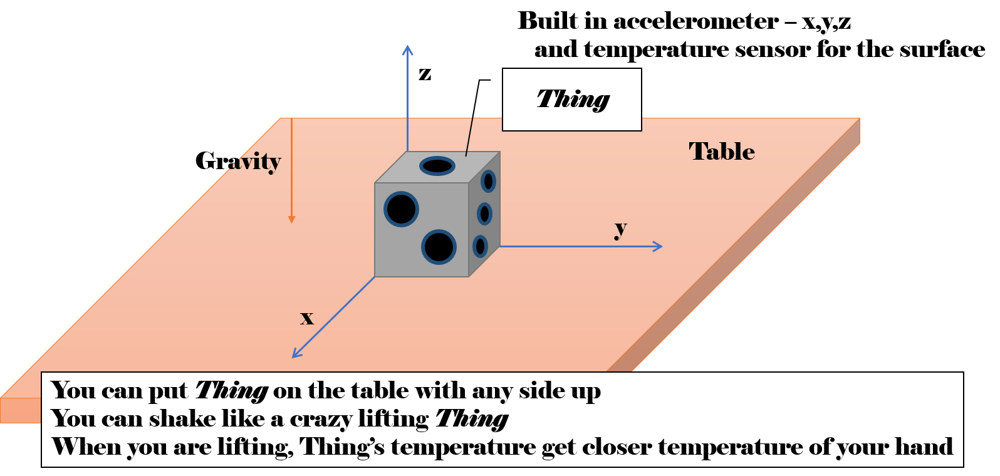

# Azure IoT Device App Samples like Rosetta Stone style  
This is a sample to illustrate what happens when device applications for IoT of the same specification are developed in different programming languages using Azure IoT Device SDK for each language. 

## Specification  

This sample application run in the "Thing" and connected to Azure IoT Hub.
 
Application features 
- send telemetry data(accelerometer and temperature) at specified interval
- receive command from Azure IoT Hub 
- receive Device Twin Desired Properties update on the cloud side 
- receive invocation request of Device Method from the cloud 

Simulator sends following format message.
```json
{
"accelerometerx":-0.0044034717671589327, "accelerometery":0.0040134866507786724, "accelerometerz":-0.99999961030203832, "temperature":24.969412063120853, 
"time":"2018-07-23T10:56:58.1204821+09:00"
}
```

The received texts of command, desired properties updated and device method invocation from the cloud are shown in console window. 

In addition, you can do several action by console.  
- upload file to the cloud 
- send your specific message to the cloud 
- report status by Device Twin Reported Properties to the cloud  
- shake lifting the "Thing" 
- put "Thing" on the table with any side up  

"Thing" has marks like dice on each side and you can specify which side is face up with that mark. 

## Configuarable parameters 
You can specify following configuration parameters related this application execution. 
- For the simulator  
    - connection-string 
        - connection string for simulator device on Azure IoT Hub 
    - room-temperature  
        - temperature of room 
        - When "Thing" put on the table, face temperature get closer to it  
    - telemetry-cycle-msec 
        - interval for units of milli seconds of sending accelerometer and temperature of "Thing" 
    - update-interval-msec 
        - interval for units of milli seconds of update simulated value for accelerometer and temperature  
- For the Thing 
    - face-top 
        - the top side of Thing at the application start time 
    - max-accel-value 
        - the max accelerometer value during you shake like a crazy 
    - accelerometer-white-noise-rate 
        - white noise rate for accelerometer 
    - temperature-white-noise-rate 
        - white noise rate for temperature 
    - temperature-delta-coef 
        - when status of Thing changes from Putting to Shaking vice versa, "Thing"'s face temperature get closer target depend on this co efficiency parameter 

These configuration parameters are described in config.json for each language folder. 
```json
{
    "simulator":{
        "connection-string":"<< Connection String for Device in Azure IoT Hub",
        "room-temperature":25.0,
        "telemetry-cycle-msec":1000,
        "update-interval-msec":500
    },
    "thing":{
        "face-top":1,
        "max-accel-value":3.0,
        "accelerometer-white-noise-rate":0.01,
        "temperature-white-noise-rate":0.1,
        "temperature-delta-coef":0.1
    }
}
```

## For contributors  
C# application is as reference so that update implementation for other each language application soon when C# app's feature is updated. 
Each application should satisfy following matters. 
- Application should load config.json and run depend on parameters in the file.  
- Application should provide features described above. 
 